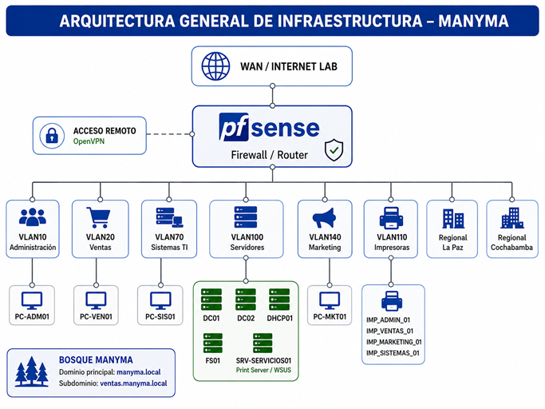
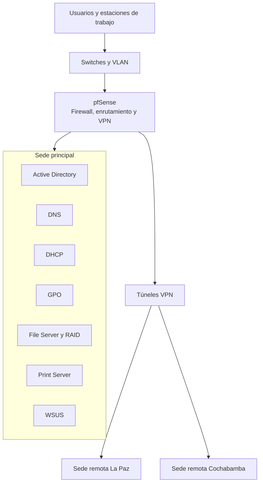

<div align="center">

# MANYMA

## Gestión Integral de Infraestructura TI Corporativa Multiciudad

Proyecto individual de diseño e implementación de una infraestructura empresarial centralizada, segmentada y conectada mediante VPN.


</div>

---
## Contenido

- [Descripción](#descripción)
- [Arquitectura](#arquitectura)
- [Tecnologías](#tecnologías)
- [Implementación](#implementación)
- [Validaciones](#validaciones)
- [Resultados](#resultados)
- [Evidencias](#evidencias)
- [Documentación](#documentación)
- [Estructura del repositorio](#estructura-del-repositorio)
- [Mejoras futuras](#mejoras-futuras)
- [Seguridad](#seguridad)
- [Autor](#autor)

---

## Descripción

MANYMA representa una infraestructura TI corporativa para una organización con presencia en varias ciudades.

El laboratorio integra administración de usuarios y equipos, servicios de red, almacenamiento, impresión, actualizaciones, segmentación, seguridad perimetral y comunicación segura entre sedes.

La solución fue implementada completamente en un entorno virtual utilizando Windows Server, VMware y pfSense.

### Información general

| Característica | Detalle |
|---|---|
| Modalidad | Proyecto académico individual |
| Año | 2026 |
| Duración aproximada | 3 semanas |
| Plataforma | VMware Workstation |
| Sistema principal | Windows Server |
| Firewall | pfSense |
| Alcance | Sede principal y sedes remotas |
| Comunicación | VPN entre sedes |
| Estado | Completado |

---

## Arquitectura

### Vista general



La infraestructura centraliza los servicios corporativos en la sede principal, utiliza pfSense para segmentación, enrutamiento y seguridad, y permite la comunicación con las sedes remotas mediante VPN.

### Arquitectura lógica resumida



pfSense funciona como punto central de enrutamiento, segmentación, filtrado y comunicación entre las diferentes redes.V

## Tecnologías

| Área | Tecnologías y servicios |
|---|---|
| Sistemas operativos | Windows Server, Windows 10, Windows 11 y Linux |
| Virtualización | VMware Workstation |
| Identidad | Active Directory Domain Services |
| Servicios de red | DNS y DHCP |
| Administración | Group Policy Objects |
| Almacenamiento | File Server y RAID |
| Impresión | Print Server |
| Actualizaciones | WSUS |
| Firewall | pfSense |
| Segmentación | VLAN y VLSM |
| Acceso remoto | OpenVPN |
| Seguridad | Reglas de firewall y pfBlockerNG |
| Gestión de tráfico | QoS |

---

## Implementación

### Identidad y control de acceso

- Instalación de Active Directory Domain Services.
- Creación del dominio corporativo.
- Organización mediante unidades organizativas.
- Creación de usuarios, grupos y equipos.
- Unión de estaciones de trabajo al dominio.
- Asignación de permisos según funciones.

### Servicios de red

- Configuración de DNS.
- Configuración de DHCP.
- Creación de ámbitos, exclusiones y reservas.
- Diseño de direccionamiento mediante VLSM.
- Validación de conectividad y resolución de nombres.

### Políticas y administración centralizada

- Creación y aplicación de políticas GPO.
- Restricción de configuraciones no autorizadas.
- Administración de equipos del dominio.
- Gestión de actualizaciones mediante WSUS.

### Almacenamiento e impresión

- Configuración de File Server.
- Creación de carpetas compartidas.
- Aplicación de permisos según grupos.
- Implementación de almacenamiento RAID.
- Configuración de Print Server.

### Redes y seguridad

- Instalación y configuración de pfSense.
- Creación de interfaces y redes internas.
- Segmentación mediante VLAN.
- Configuración de reglas de firewall.
- Implementación de OpenVPN.
- Comunicación segura entre sedes.
- Filtrado mediante pfBlockerNG.
- Priorización de tráfico mediante QoS.

---

## Validaciones

| Prueba realizada | Resultado |
|---|---|
| Unión de equipos al dominio | ✅ Correcto |
| Autenticación de usuarios | ✅ Correcto |
| Resolución de nombres DNS | ✅ Correcto |
| Asignación automática mediante DHCP | ✅ Correcto |
| Aplicación de políticas GPO | ✅ Correcto |
| Acceso a carpetas compartidas | ✅ Correcto |
| Aplicación de permisos por grupo | ✅ Correcto |
| Impresión en red | ✅ Correcto |
| Comunicación entre VLAN autorizadas | ✅ Correcto |
| Bloqueo de tráfico no permitido | ✅ Correcto |
| Comunicación mediante VPN | ✅ Correcto |
| Administración de actualizaciones | ✅ Correcto |
| Disponibilidad del almacenamiento | ✅ Correcto |

---

## Resultados

- Administración centralizada de usuarios, grupos y equipos.
- Implementación de servicios corporativos con Windows Server.
- Segmentación de áreas mediante VLAN.
- Comunicación segura entre sedes.
- Control de acceso mediante reglas de firewall.
- Gestión centralizada de archivos, impresoras y actualizaciones.
- Implementación de almacenamiento con tolerancia a fallos.
- Validación técnica de conectividad, acceso y disponibilidad.
- Documentación completa de la infraestructura.

---
## Evidencias

Las capturas y validaciones técnicas se encuentran organizadas en cuatro bloques principales:

| Componente | Evidencias |
|---|---|
| Active Directory | [Ver evidencias](evidencias/active-directory/) |
| DNS y DHCP | [Ver evidencias](evidencias/dns-dhcp/) |
| pfSense, VLAN y VPN | [Ver evidencias](evidencias/pfsense-vlan-vpn/) |
| GPO, File Server y RAID | [Ver evidencias](evidencias/gpo-file-server-raid/) |

También puedes consultar el [índice general de evidencias](evidencias/).
---

## Documentación

## Documentación

| Documento | Contenido |
|---|---|
| [Arquitectura](docs/arquitectura.md) | Diseño lógico y funcionamiento general de la infraestructura |
| [Direccionamiento IP](docs/direccionamiento-ip.md) | Redes, subredes, VLAN, gateways y rangos DHCP |
| [Diagramas](diagramas/) | Arquitectura general del laboratorio |
| [Evidencias técnicas](evidencias/) | Capturas y validaciones organizadas por componente |
---

## Estructura del repositorio

```text
manyma-infraestructura-ti-multiciudad/
├── README.md
├── docs/
│   ├── arquitectura.md
│   └── direccionamiento-ip.md
├── diagramas/
│   ├── README.md
│   └── arquitectura-general-manyma.png
└── evidencias/
    ├── README.md
    ├── active-directory/
    │   ├── README.md
    │   └── evidencias visuales
    ├── dns-dhcp/
    │   ├── README.md
    │   └── evidencias visuales
    ├── pfsense-vlan-vpn/
    │   ├── README.md
    │   └── evidencias visuales
    └── gpo-file-server-raid/
        ├── README.md
        └── evidencias visuales
```

---

## Mejoras futuras

- Implementar monitoreo centralizado de servidores.
- Automatizar respaldos y pruebas de recuperación.
- Agregar autenticación multifactor.
- Incorporar redundancia para servicios críticos.
- Centralizar registros mediante una solución SIEM.
- Integrar servicios híbridos o en la nube.

---

## Seguridad

Este proyecto fue desarrollado en un entorno académico y virtual.

Por seguridad, el repositorio no publica:

- Contraseñas.
- Credenciales administrativas.
- Claves privadas.
- Direcciones IP públicas.
- Datos personales.
- Archivos con secretos.
- Información de infraestructura real.

Las direcciones IP privadas, nombres de dominio y configuraciones corresponden únicamente al laboratorio.

---

## Autor

**Alex Jhail Sánchez Rea**  
Egresado de Ingeniería de Sistemas

[LinkedIn](https://www.linkedin.com/in/alexjhailsanchezrea) · [GitHub](https://github.com/AlexJhailSanchezRea)

---

<div align="center">

Proyecto desarrollado como parte del Examen de Grado de Ingeniería de Sistemas.

</div>
