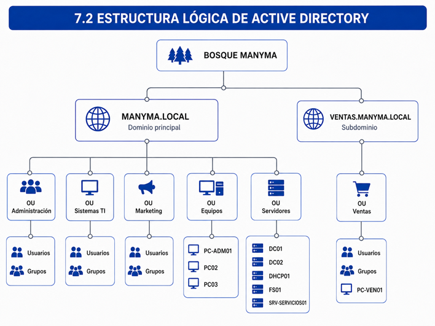
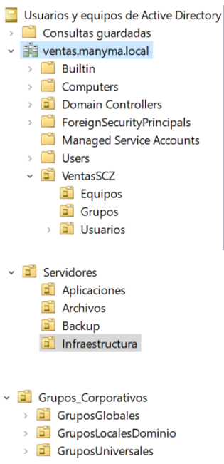
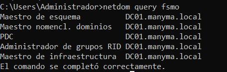

# Active Directory

## Objetivo

Implementar una administración centralizada de usuarios, grupos, equipos y permisos mediante Active Directory Domain Services.

## Evidencias requeridas

| Evidencia | Descripción |
|---|---|
| Dominio configurado | Vista del dominio desde Usuarios y equipos de Active Directory |
| Unidades organizativas | Estructura de áreas de la organización |
| Usuarios y grupos | Cuentas y grupos creados según funciones |
| Equipos del dominio | Estaciones registradas en Active Directory |
| Inicio de sesión | Validación de acceso con una cuenta del dominio |

## Archivos

Las capturas deben guardarse con estos nombres:

```text
01-dominio-configurado.png
02-unidades-organizativas.png
03-usuarios-y-grupos.png
04-equipos-del-dominio.png
05-inicio-sesion-dominio.png
## Evidencias visuales

### 1. Arquitectura de Active Directory

La arquitectura implementada contempla el dominio corporativo y la organización lógica de los servicios de directorio.



---

### 2. Estructura de unidades organizativas

Se organizaron usuarios, grupos, equipos y servidores mediante unidades organizativas para facilitar su administración.



---

### 3. Roles FSMO

Se verificó la correcta asignación y disponibilidad de los roles FSMO dentro del dominio.


