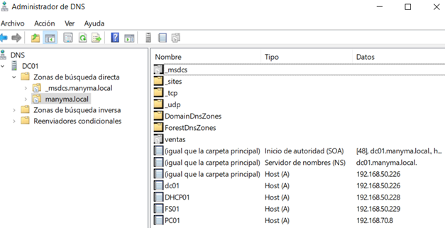
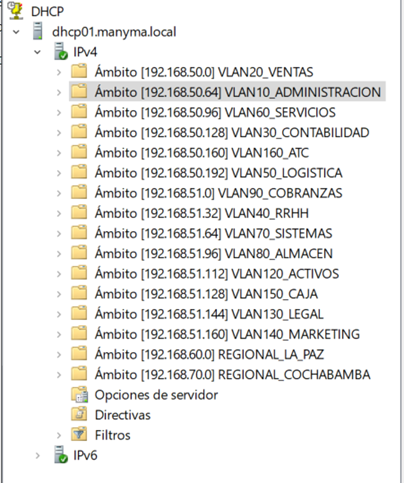
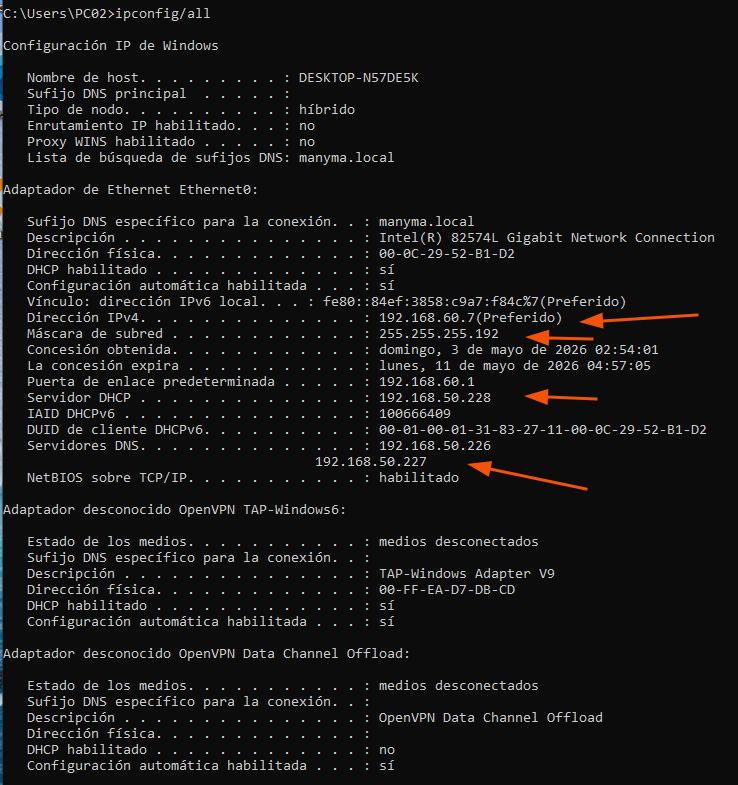

# DNS y DHCP

## Objetivo

Implementar servicios centralizados de resolución de nombres y asignación automática de direcciones IP para los equipos de la infraestructura MANYMA.

## Componentes validados

| Componente | Estado |
|---|---|
| Zona DNS del dominio | ✅ Configurada |
| Registros DNS | ✅ Configurados |
| Resolución mediante `nslookup` | ✅ Validada |
| Servidor DHCP | ✅ Implementado |
| Ámbitos DHCP | ✅ Configurados |
| DHCP Relay en pfSense | ✅ Configurado |
| Asignación automática de IP | ✅ Validada |

## Evidencias visuales

### 1. DNS interno y prueba con nslookup

Se verificó la configuración del servicio DNS interno y la resolución correcta de nombres dentro del dominio.

---

### 2. Ámbitos DHCP y DHCP Relay

Se configuraron los ámbitos DHCP y el reenvío de solicitudes mediante DHCP Relay en pfSense para atender los diferentes segmentos de red.

---

### 3. Validación en un equipo cliente

Se comprobó que el equipo cliente recibiera automáticamente una dirección IP, máscara de subred, gateway y servidor DNS.

## Resultado

La implementación permitió centralizar la resolución de nombres y la asignación de configuraciones de red, facilitando la administración de los equipos conectados a la infraestructura MANYMA.
