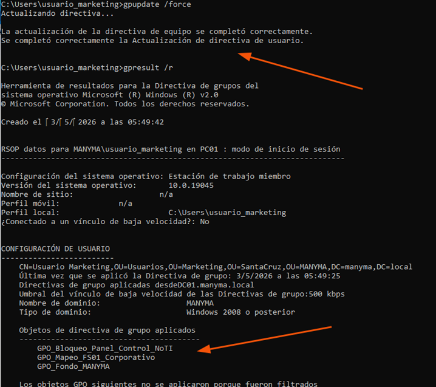
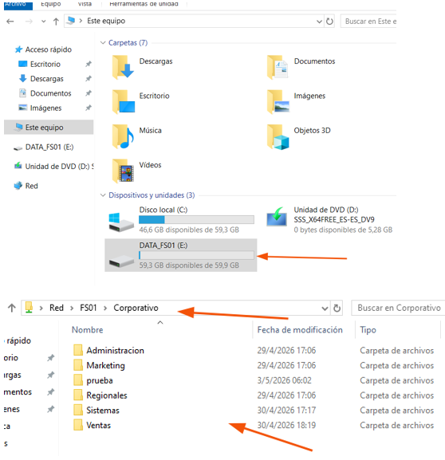
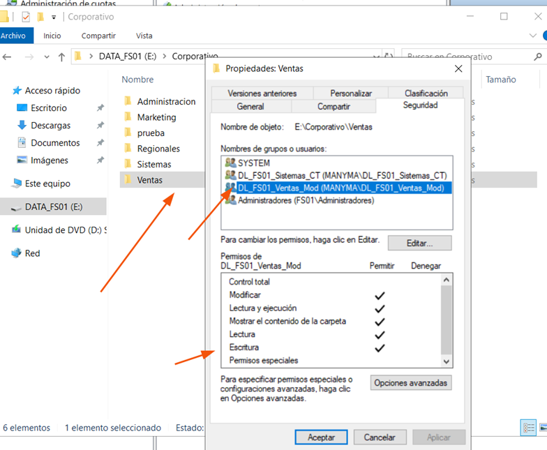
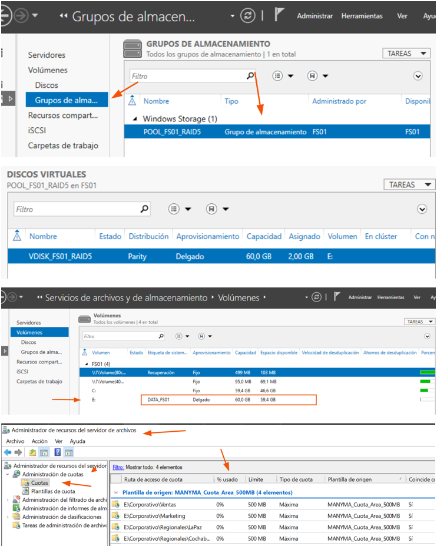

# GPO, File Server y RAID

## Objetivo

Implementar políticas de administración centralizada, almacenamiento corporativo, control de permisos y tolerancia a fallos dentro de la infraestructura MANYMA.

## Componentes validados

| Componente | Estado |
|---|---|
| Políticas GPO | ✅ Aplicadas |
| Administración centralizada | ✅ Validada |
| File Server | ✅ Implementado |
| Carpetas compartidas | ✅ Configuradas |
| Permisos mediante grupos | ✅ Aplicados |
| Acceso no autorizado | ✅ Bloqueado |
| Storage Spaces | ✅ Configurado |
| RAID 5 con paridad | ✅ Implementado |

## Evidencias visuales

### 1. Aplicación de políticas GPO

Se implementaron políticas de grupo para administrar configuraciones, restricciones y recursos de los usuarios y equipos pertenecientes al dominio.



---

### 2. Estructura del File Server

Se configuró un servidor de archivos con recursos compartidos organizados según las áreas de la empresa.



---

### 3. Permisos y acceso denegado

Se aplicó una estructura de grupos y permisos para controlar el acceso a los recursos compartidos. La prueba demuestra el bloqueo a usuarios no autorizados.



---

### 4. Storage Spaces y RAID 5

Se implementó almacenamiento con paridad mediante Storage Spaces para mejorar la disponibilidad y protección de los datos.



## Modelo de acceso

```mermaid
flowchart LR
    USER[Usuario del dominio]
    GLOBAL[Grupo global]
    LOCAL[Grupo local del dominio]
    PERMISSION[Permiso sobre carpeta]
    RESOURCE[Recurso compartido]

    USER --> GLOBAL
    GLOBAL --> LOCAL
    LOCAL --> PERMISSION
    PERMISSION --> RESOURCE
