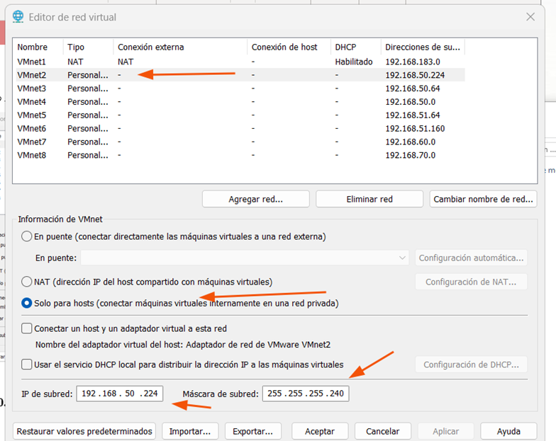
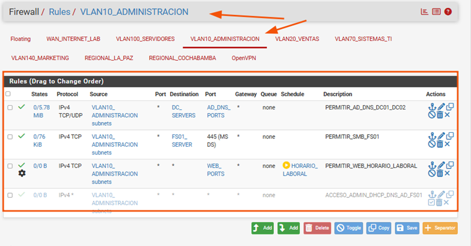
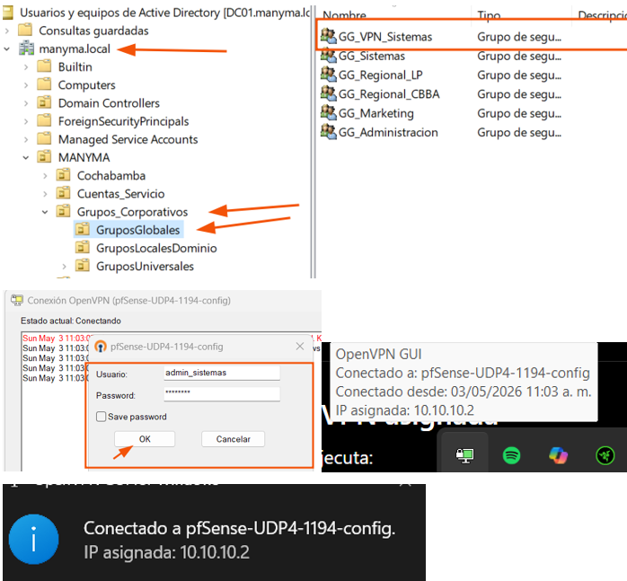

# pfSense, VLAN y VPN

## Objetivo

Implementar segmentación de red, control de tráfico y comunicación segura entre sedes mediante pfSense, VLAN, VLSM y OpenVPN.

## Componentes validados

| Componente | Estado |
|---|---|
| Segmentación mediante VLAN | ✅ Implementada |
| Direccionamiento mediante VLSM | ✅ Configurado |
| Interfaces de pfSense | ✅ Configuradas |
| Enrutamiento entre redes | ✅ Validado |
| Reglas de firewall | ✅ Aplicadas |
| Bloqueo de tráfico no autorizado | ✅ Validado |
| Servicio OpenVPN | ✅ Implementado |
| Conectividad VPN | ✅ Validada |

## Evidencias visuales

### 1. Segmentación de redes

Se diseñaron segmentos de red independientes para usuarios, servidores, impresoras y sedes remotas, utilizando VMnet, VLAN y direccionamiento VLSM.



---

### 2. Reglas de firewall en pfSense

Se configuraron reglas de firewall para controlar la comunicación entre segmentos, permitir únicamente los servicios necesarios y bloquear el tráfico no autorizado.



---

### 3. Conectividad mediante OpenVPN

Se implementó OpenVPN para permitir la comunicación segura entre redes y usuarios autorizados del laboratorio.



## Flujo de comunicación

```mermaid
flowchart LR
    USERS[Usuarios y equipos]
    VLAN[VLAN y segmentos]
    FW[pfSense]
    SERVERS[Servidores corporativos]
    VPN[OpenVPN]
    REMOTE[Sedes o usuarios remotos]

    USERS --> VLAN
    VLAN --> FW
    FW --> SERVERS
    FW --> VPN
    VPN --> REMOTE
